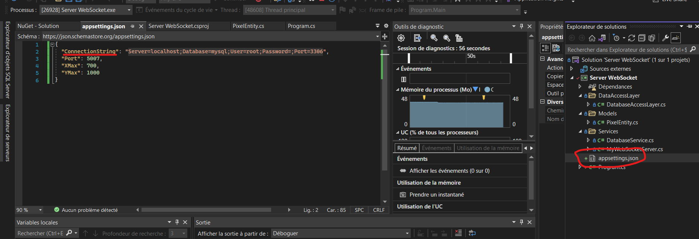

# Pixel War

## Description du Projet

Cette application se compose d'un client Angular et d'un serveur .NET.
Le but de cette application est de recréer le jeu PixelWar de Reddit en posant des carrés de couleur sur une grille.

## Screenshot


## Prérequis

Avant de commencer, assurez-vous d'avoir les éléments suivants installés sur votre système :

- Node.js et npm : [Télécharger et Installer](https://nodejs.org/)
- Angular CLI : Pour installer Angular CLI, utilisez la commande suivante : `npm install -g @angular/cli`
- VS2022 : [Télécharger et Installer](https://visualstudio.microsoft.com/fr/downloads/)
- Wamp : [Télécharger et Installer](https://www.wampserver.com/)

## Installation

Clonez ce repository sur votre machine locale en utilisant la commande suivante :
```bash
git clone https://gitlab.com/TheoRamousse/tp2websocket.git
```
Naviguez vers le répertoire du projet :
```bash
cd tp2websocket/websocket-project
```
Installez les dépendances en utilisant npm :
```bash
npm install
```
Démarrez l'application en utilisant la commande suivante :
```bash
ng serve
```
(l'url par défaut du projet est en général localhost:4200)

Se rendre ensuite sur wamp dans la partie PHPMyAdmin et exécuter le script qui se trouve dans le dossier scripts du repo


Pour finir, démarrer le projet C# sur VS2022 qui se trouve dans le dossier "Serveur Websocket" et remplacer la connection string de la db par la votre dans Program.cs : 



Démarrer ensuite le serveur (peut prendre 1 ou 2 minutes à démarrer et vous aurez un message lorsqu'il sera démarré)

Vous pouvez ensuite rafraichir la page avec le client et vous pourrez ensuite jouer !

## Auteur

Théo RAMOUSSE